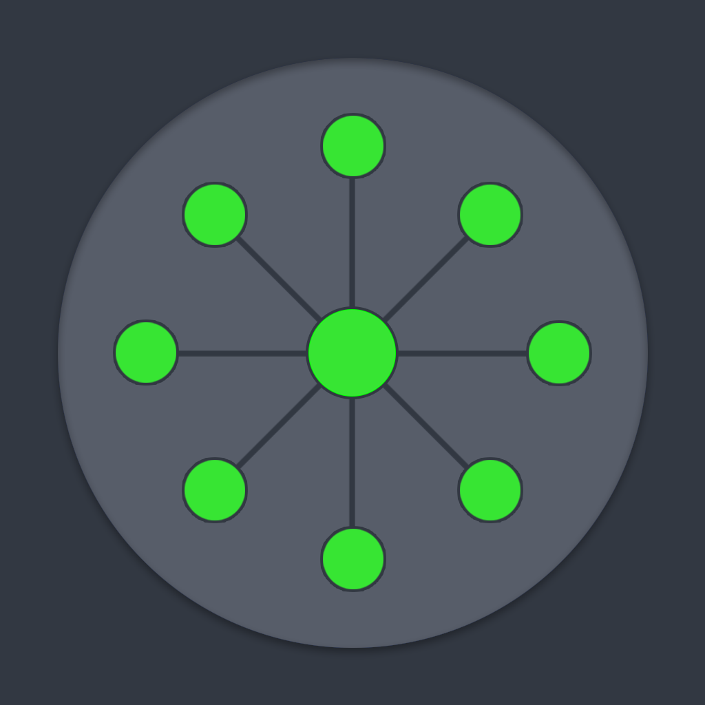

# netviz

[📚 Project Documentation](https://gitlab.fhnw.ch/ip6-26bb_netviz/netviz-docs) | [📚 API Documentation](https://fastapi1.cybersec-fhnw.org/docs) | [🌐 Narrowin Demo](https://fastapi1.cybersec-fhnw.org)

[🌐 Live Demo](https://ip6-26bb_netviz.pages.fhnw.ch/netviz/)

 

## Overview

This project uses [@hey-api/openapi-ts](https://www.npmjs.com/package/@hey-api/openapi-ts) to generate an SDK from the [OpenAPI specification](https://fastapi1.cybersec-fhnw.org/api/openapi.json) of the API (see [API Docs](https://fastapi1.cybersec-fhnw.org/docs)). The generated client is then used to fetch data and visualize it using [Cytoscape.js](https://js.cytoscape.org/).

Visualizations are created in the [`src/visualizations`](src/visualizations) directory and imported into the main [index.html](index.html) file. The project is set up to allow for easy addition of new visualizations by following the existing structure.

## Getting started

Optimal DX is achieved by using [Dev Containers](https://containers.dev/) via the Visual Studio Code [Dev Containers Extension](https://marketplace.visualstudio.com/items?itemName=ms-vscode-remote.remote-containers). Just open the project in VSCode and click "Reopen in Container" when prompted. This will set up a consistent development environment across platforms. See the extension documentation for more details.

1. Open the project in VSCode and use the "Reopen in Container" option to set up the development environment.

2. Copy the `env.example` file to `.env.local` and adjust the parameters to your credentials and base URL.

3. Install the dependencies by running `pnpm install` in the terminal.

4. Generate the client code by running `pnpm run prepare`.

5. To start the client run `pnpm run dev`.

6. For debugging you can use the integrated debugger from VSCode or use the Debugger for Firefox plugin. The plugin is installed in the devcontainer but needs also to be added locally. [launch.json](.vscode/launch.json) is already configured for debugging with Firefox.

## Documentation

- [Cytoscape.js](https://js.cytoscape.org/)
- [DevPod](https://devpod.sh/docs/what-is-devpod)
- [DevContainer](https://containers.dev/)